# Obsidian Plugin Installation

This guide explains how to install and configure the Obblogdian plugin for Obsidian. It covers three parts:

- Install and configure the "Remotely Save" plugin (for WebDAV storage)
- Install the Obblogdian plugin
- (Optional) Install the Obblogdian CSS snippet

---

## 1. Install the Remotely Save plugin (WebDAV)

1. Open Obsidian settings, go to "Community plugins", and enable community plugins.

   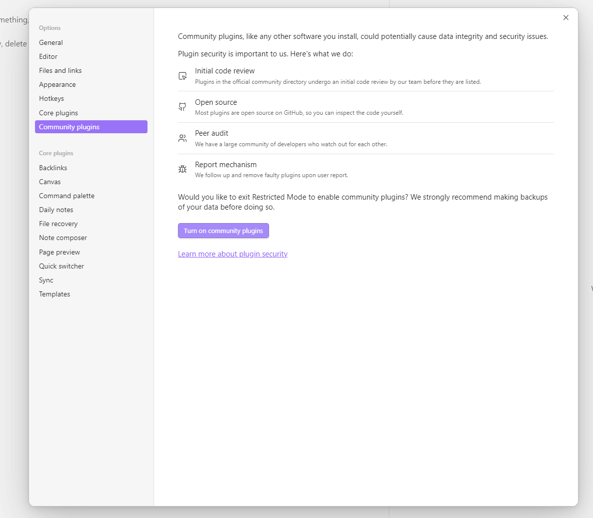

2. Search for "Remotely Save", install it, and enable the plugin.

   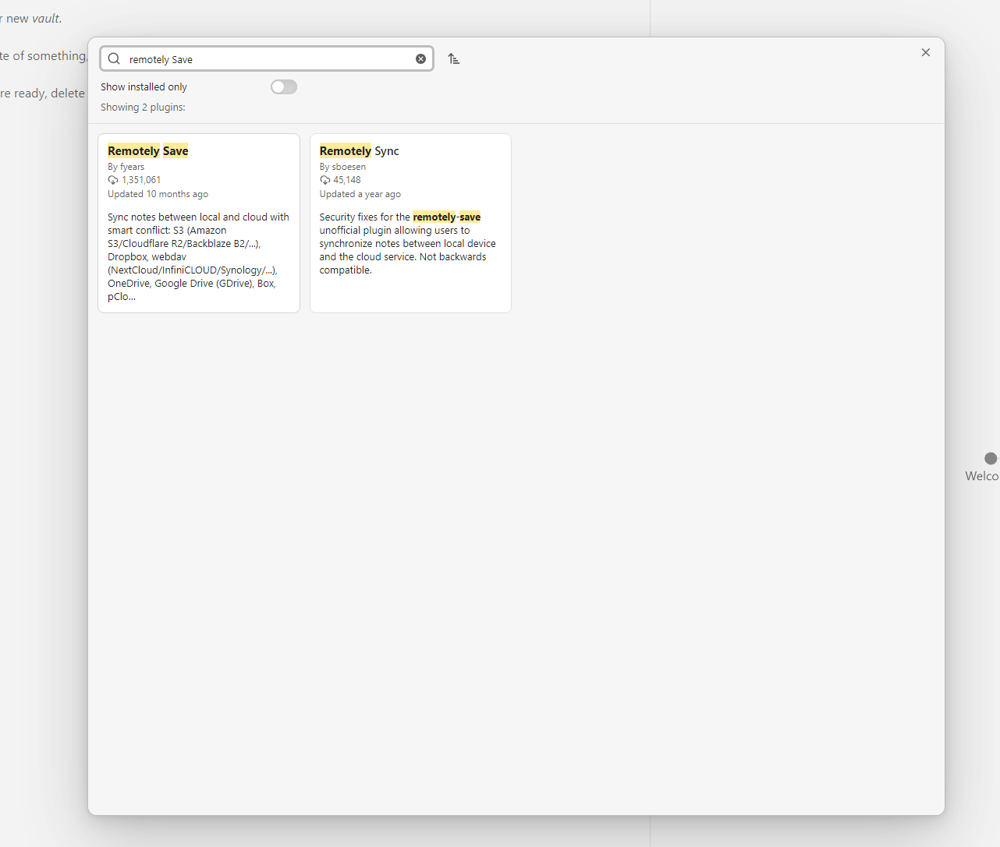
   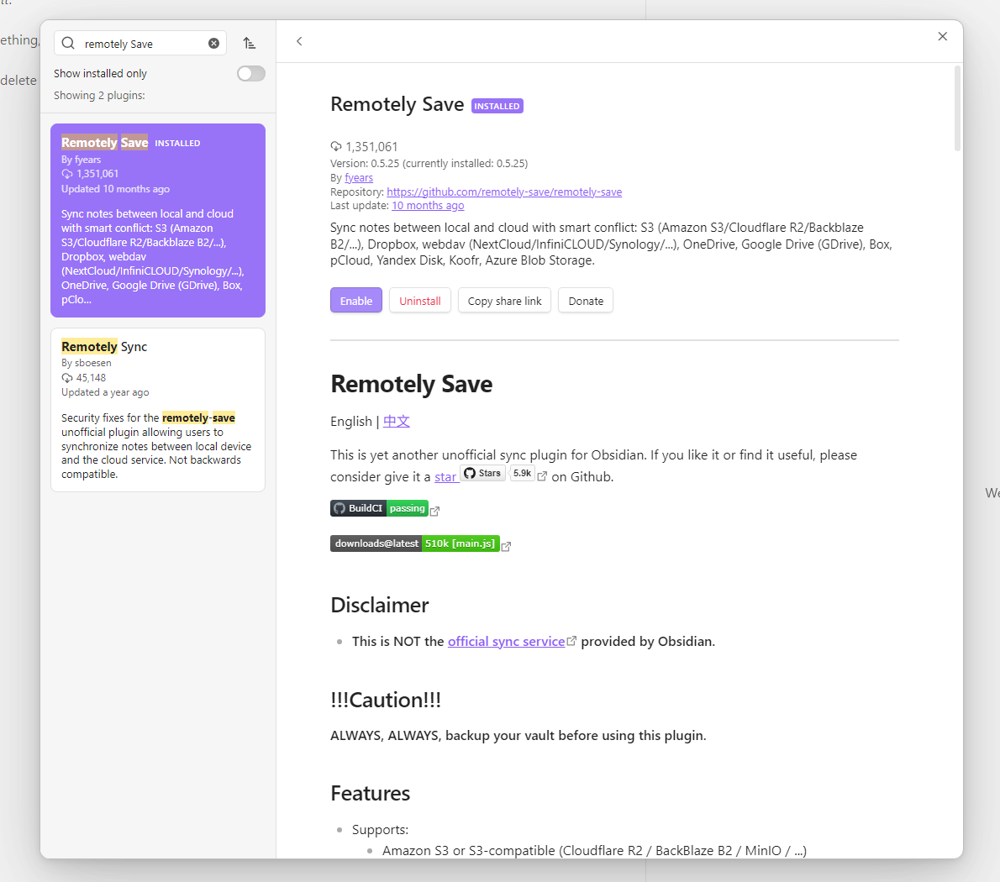

3. Open the Remotely Save settings, choose the WebDAV option, and enter your **server address**, **username**, and **password**.

   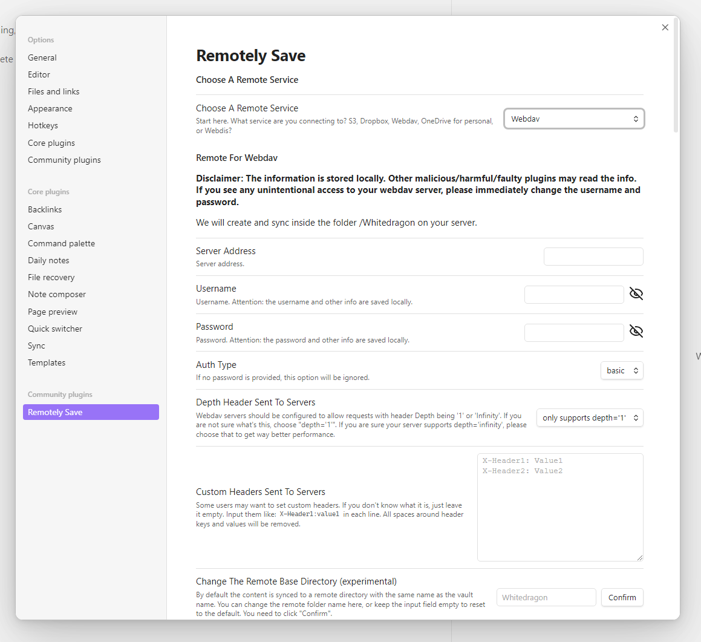

**Tips:**

- Ensure your WebDAV server is reachable from the machine running Obsidian.
- If you host WebDAV yourself, confirm TLS and credentials are correct.

---

## 2. Install the Obblogdian plugin

1. Open your Obsidian vault folder and navigate to `.obsidian/plugins`.

   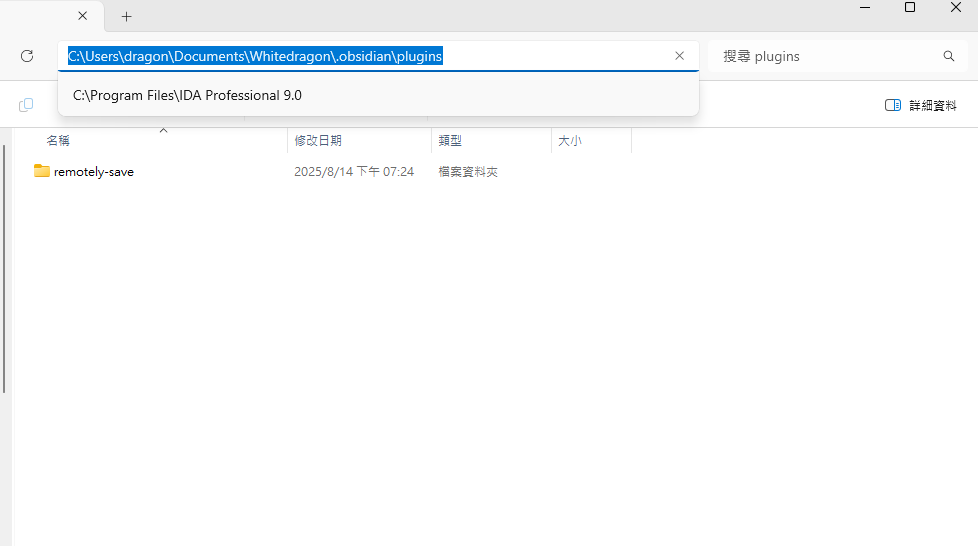

2. Download the latest `Obblogdian.zip` from the releases page and extract it into the `plugins` folder:

   https://github.com/Whitedragon115/Obblogdian/releases

   After extraction the plugin folder should look similar to these screenshots:
   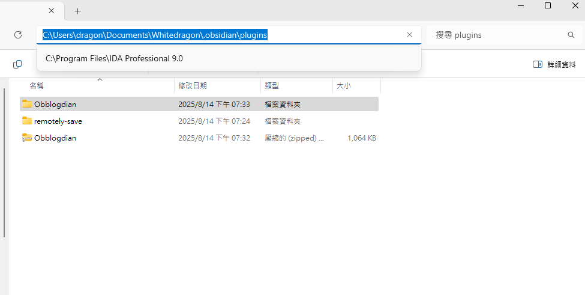
   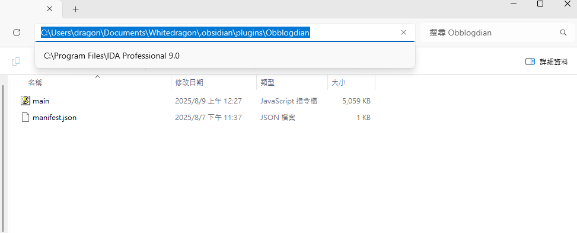

3. Reload Obsidian by pressing `Ctrl + P`, typing "reload app" or "reload window", and selecting the reload command, or restart Obsidian.

4. In Settings → Community plugins, enable the Obblogdian plugin.

   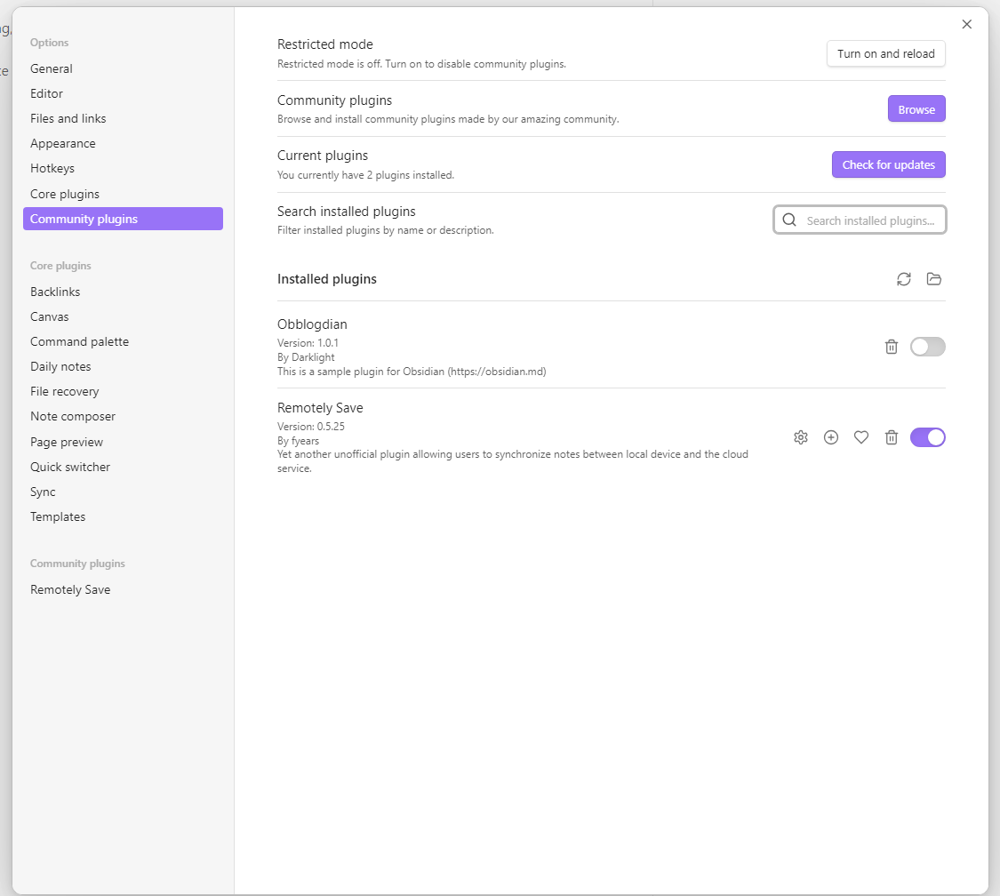

5. Open the Obblogdian plugin settings and fill in the required values (blog folder path, WebDAV paths, API settings, etc.).

   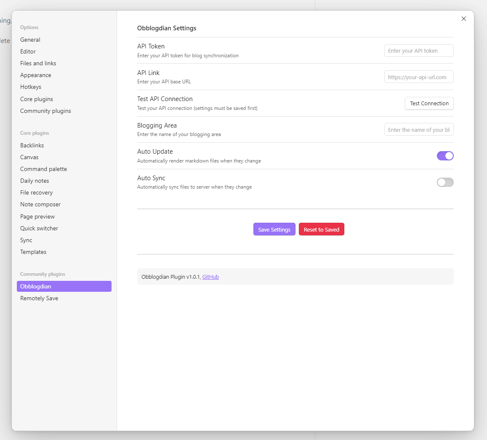

6. Save the plugin settings so the plugin can create the blog folder and necessary files.

   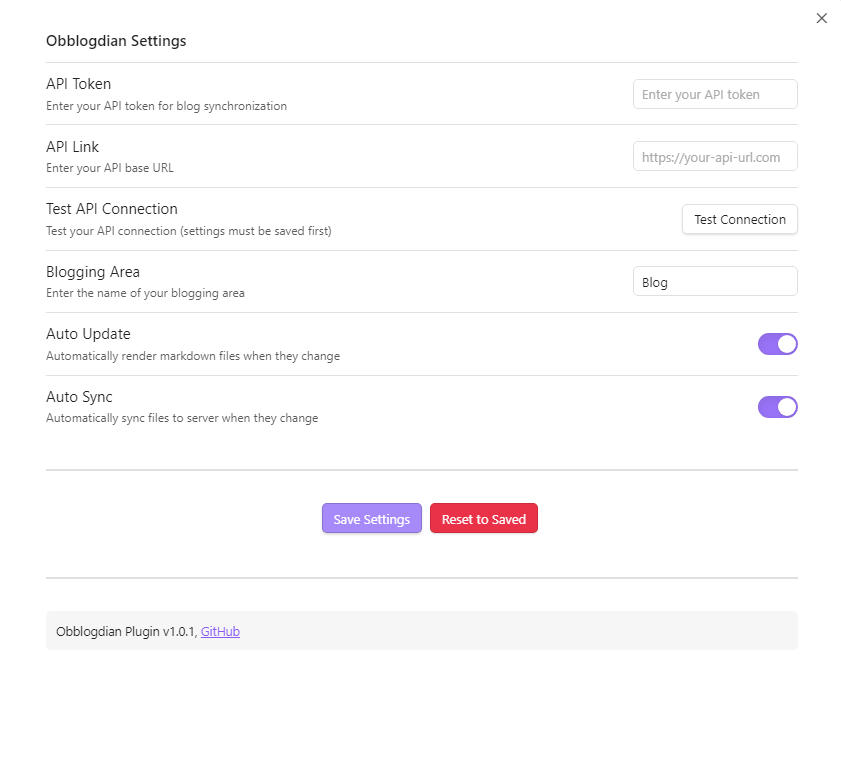

7. You can now create and manage posts inside the configured blog folder.

---

## 3. Optional: Install the Obblogdian CSS snippet

1. Go to Settings → Appearance → CSS snippets and click the folder icon to open the snippets folder.

   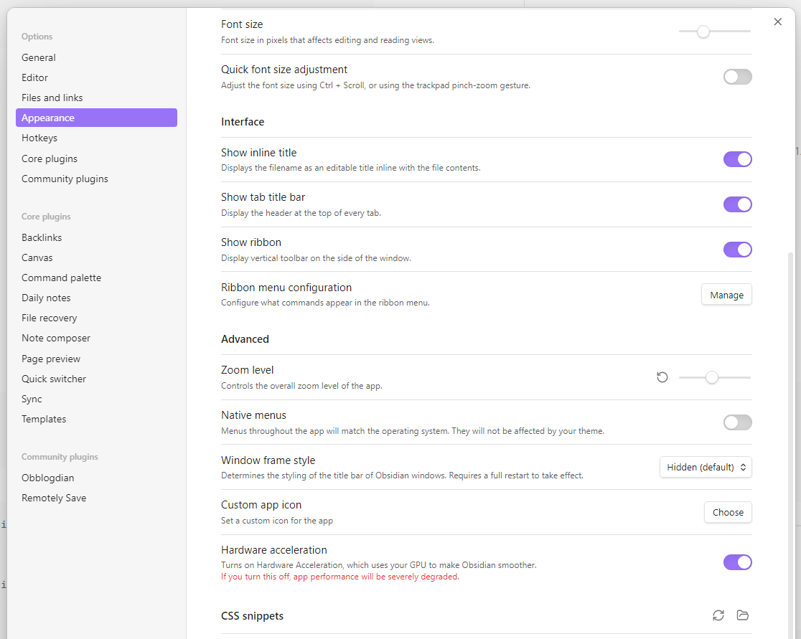

2. Download `Obblogdian.css` from newest release, place it in the snippets folder, return to Obsidian, and enable the snippet.

   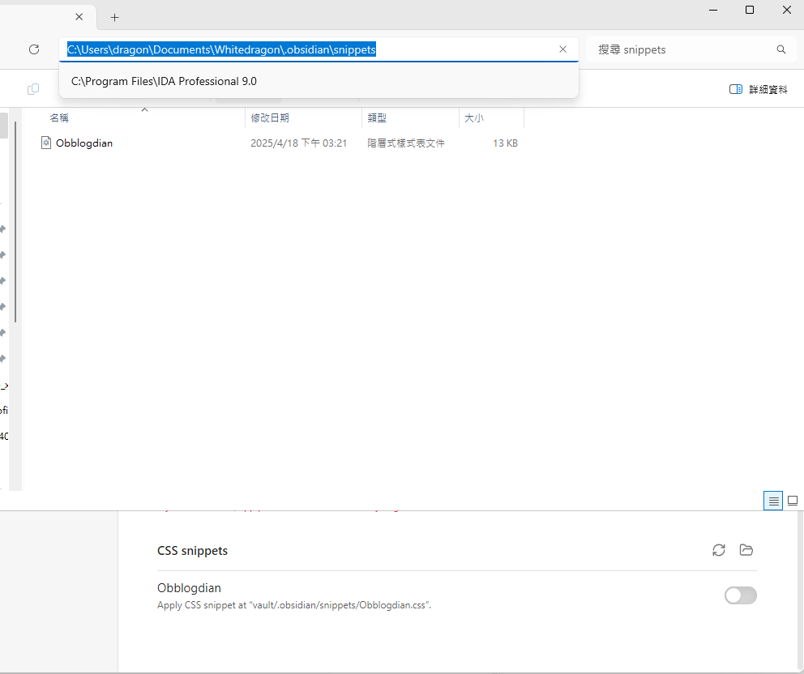
   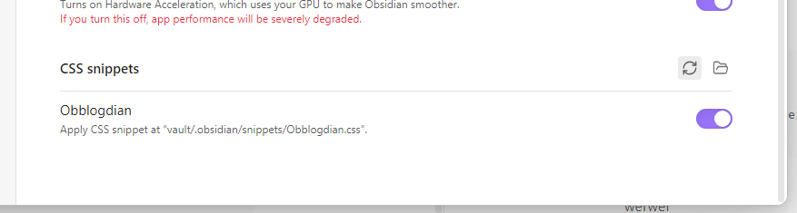

**Note:** The CSS is designed for dark mode. To enable dark mode go to Settings → Appearance → Base theme → Dark.

   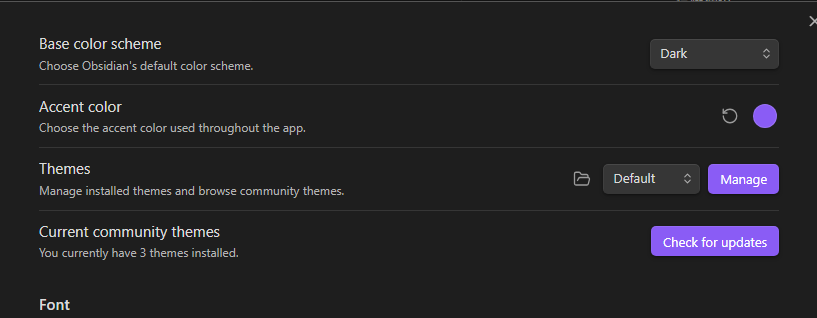

Try different community themes if you want a different look—many themes work well with the snippet.

---

## WebDAV server suggestions

If you don't have a WebDAV server already, consider these options:

- [PicoDav by kd2org](https://github.com/kd2org/picodav)
- [hacdias-webdav by hacdias](https://github.com/hacdias/webdav)
- [WsgiDAV by mar10](https://github.com/mar10/wsgidav)
- [Cloudreve by HF04](https://github.com/cloudreve/cloudreve)

I use Cloudreve because it offers a convenient self-hosted alternative to cloud storage.
