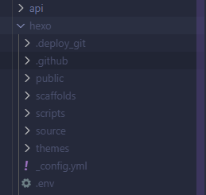

# Hexo Server Installation

This document explains how to set up the Hexo server used by Obblogdian. It covers the project layout, required environment variables, ways to host the server, and step-by-step setup instructions.

---

## 📦 Project Structure

```
├── Blog/
│   ├── api/                      # API endpoints
│   │   ├── deploy.js             # Handle blog deployment
│   │   ├── ping.js               # Server connectivity test
│   │   ├── server-start.js       # Start Hexo server
│   │   ├── server-stop.js        # Stop Hexo server
│   │   └── sync.js               # Sync markdown data
│   ├── utils/                    # Utility functions
│   │   ├── control/              # Hexo control utilities
│   │   │   ├── deployHexo.js     # Deploy Hexo blog
│   │   │   ├── startHexo.js      # Start Hexo process
│   │   │   └── stopHexo.js       # Stop Hexo process
│   │   ├── hexo.js               # Hexo instance management
│   │   ├── logging.js            # Logging utilities
│   │   └── sync.js               # WebDAV sync utilitie
│   ├── .env                      # Environment variables
│   ├── index.js                  # Main server file
│   ├── package.json              # Project dependencies
```

## Environment Variables

Set these in your `.env` file or the host environment before running the server.

| Variable Name        | Description                                                       |
| -------------------- | ----------------------------------------------------------------- |
| `API_TOKEN`          | Token used by the Obsidian plugin to authenticate with the server |
| `SERVER_LINK`        | Public preview URL for your blog (optional)                       |
| `WEBDAV_URL`         | WebDAV server URL used to sync notes                              |
| `WEBDAV_USERNAME`    | WebDAV username                                                   |
| `WEBDAV_PASSWORD`    | WebDAV password                                                   |
| `WEBDAV_REMOTE_BASE` | Remote base path on the WebDAV server                             |
| `AUTO_SHUTDOWN`      | Auto-shutdown timeout (seconds) — optional                        |
| `API_PORT`           | Port the API listens on (used by the Obsidian plugin)             |
| `PREVIEW_PORT`       | Port used for Hexo preview (the blog preview server)              |

```env
API_TOKEN = <Token used by the Obsidian plugin to authenticate with the server>
SERVER_LINK = <Public preview URL for your blog (optional)>
WEBDAV_URL = <WebDAV server URL used to sync notes>
WEBDAV_USERNAME = <WebDAV username>
WEBDAV_PASSWORD = <WebDAV password>
WEBDAV_REMOTE_BASE = <Remote base path on the WebDAV server>
AUTO_SHUTDOWN = <Auto-shutdown timeout (seconds) — optional>
API_PORT = <Port the API listens on (used by the Obsidian plugin)>
PREVIEW_PORT = <Port used for Hexo preview (the blog preview server)>
```

---

## How to run the server

The server requires Node.js v21+ and two available ports (API and preview). Below are two common hosting options and step-by-step instructions for each.

### 1) Run on a VPS

If you plan to use a VPS, choose a provider that supports Node.js and allows opening at least two ports. Some free or low-cost providers you can try (availability varies):

- <https://freeserver.tw/>
- <https://shdtw.cloud/>
- <https://flybirdhost.net/>
- <https://hypernology.com/>
- <https://resonancecraft.net/>
- <https://shop-fmdb.maybeisfree.host/>

> Note: free services may be unreliable or have limited network/port support.


### 2) Self-host (recommended if you have a spare machine)

If you have a machine that can run 24/7 on your home network, self-hosting is a good option. For NAT or mobile connections, you may need a domain and a tunnel (e.g. Cloudflare Tunnel).

**Requirements:**

- Node.js v21+ installed
- Two available ports (one for API, one for preview)
- Optional: domain name + Cloudflare Tunnel if under NAT or mobile networks

**Setup steps:**

1. Install Node.js v21+ on the host (see instructions below for Windows/Linux).
2. Create a working folder and download the [project files](release):
3. Rename the folder named `rename to hexo` to `hexo`.
4. Copy your existing Hexo blog into the `hexo` folder so the structure matches your Hexo site.

   

5. From the `Blog` folder, install dependencies and start the server:

```bash
cd Blog
npm install
node index.js
```

1. (If using a shared/mobile network) Install Cloudflare Tunnel and expose the preview port with Cloudflare Tunnel (what to set)

   We won't cover installation here. Follow the official guide:
   [Cloudflare Tunnel — Create a tunnel](https://developers.cloudflare.com/cloudflare-one/connections/connect-networks/get-started/create-remote-tunnel/)

    Configure these values for this project:

    - Tunnel name: any name (e.g., `obblogdian-preview`)
    - Hostname: the public URL you want (e.g., `preview.yourdomain.name`)
    - Service/URL target: `http://localhost:${PREVIEW_PORT}` (default `http://localhost:4001`)

## Contact / Hosting offer

I have a personal server where I can sometimes host small projects, but I cannot guarantee availability or security. I strongly recommend self-hosting or using a trusted VPS provider.

If you still need help and accept the risks, contact me on Discord (details at the bottom of the project) and we'll discuss options.
