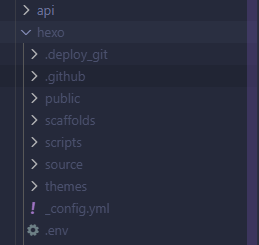

# Obblogdian

Hi, Im whitedraogn, this is a small side-project I develope for a better way to write your blog in obsidian and not in vscode anymore

# Hexo Server Installation

- **📦 Project Structure**

```
├── Blog/
│   ├── api/              # API endpoints
│   ├── utils/            # Utility functions
│   ├── hexo/             # Hexo blog files
│   ├── index.js          # Main server file
│   └── package.json      # Dependencies
```

- **Environment**

| ENV                | Setting                                                |
| ------------------ | ------------------------------------------------------ |
| API_TOKEN          | your token to connect to server                        |
| SERVER_LINK        | your online blog preview link                          |
| WEBDAV_URL         | your webdav URL                                        |
| WEBDAV_USERNAME    | webdav username                                        |
| WEBDAV_PASSWORD    | webdav password                                        |
| WEBDAV_REMOTE_BASE | the path to your blog server                           |
| AUTO_SHUTDOWN      | how long will server auto shut down                    |
| API_PORT           | the port obsidian plugin interact with hexo server api |
| PREVIEW_PORT       | the port to preview your server online                 |

> how to run server

the main idea is to have a enviroment that can run nodejs v21+ and have two port to use, that's it

if you aren't profficnal here is some suggestion

1. Running on free VPS
   There are alot of option on internet, and most of it support running nodejs, but if supporting 2 port I don't know, here are some free vps I use while ago
   - https://freeserver.tw/
   - https://shdtw.cloud/
   - https://flybirdhost.net/
   - https://hypernology.com/
   - https://resonancecraft.net/
   - https://shop-fmdb.maybeisfree.host/
   
   > some of it might broken or stop service

2. Self host
   > This option is for those have a free computer at home and you can run it in a enviorment with internet 24/7

   **What you need**
   - Nodejs v21+ install
   - 2 port needed

   and if you are using Shared Network or Phone internet
   - Domain name
   - Cloudflare tunnel

   **How to instal**
   1. Install Nodejs v21+
   2. make a folder and download the code inside from https://cloud.dragoncode.dev/s/n5RCq and unzip it
   3. rename `rename to hexo` folder to hexo
   4. copy your entire hexo to `hexo` folder, it should look like this
      
   5. run index.js

   > if you are using Shared Network or Phone internet

   6. install Cloudflare tunnel
   7. in cloudflare zerotrust add a public hostname call `<preview>.yourdoamin.name` for previewing your blog online

   > yeah I am not so good at writing instruction so the text might not be clear, well I believe AI are good at this, so I write a prompt for setting up this project I hope this help you make it work

   - [AI prompt here](https://github.com/Whitedragon115/Obblogdian/)

3. Using Zeabur 
   

# Usage

## Obsidian Plugin

So as you can see there are alot of commands, and here is what each command do

| Commands               | Description                                                        |
| ---------------------- | ------------------------------------------------------------------ |
| **Deploy Blog**        | Deploy your blog to internet by running `hexo deploy`              |
| **Preview Blog**       | Open side preview                                                  |
| **Clean Temp**         | Clean all temp files generate by side preview                      |
| **Create Metadata**    | Create metadata in blog head                                       |
| **Start Blog Server**  | Start online preview by running `hexo clean -> generate -> server` |
| **Stop Blog Server**   | Stop online preview                                                |
| **Sync Blog**          | Sync data in obsidian to server                                    |
| **Auto Render Update** | Auto update and render side preview                                |
| **Render All**         | Render all markdown                                                |
| **Auto Sync Update**   | Auto update item to server                                         |

## Hexo blog server

| Method | Route                                    | Description                  |
| ------ | ---------------------------------------- | ---------------------------- |
| POST   | https://<server.domain>/api/deploy       | Deploy blog                  |
| POST   | https://<server.domain>/api/ping         | Test can server connect      |
| POST   | https://<server.domain>/api/server/start | Start hexo server            |
| POST   | https://<server.domain>/api/server/stop  | Stop hexo server             |
| POST   | https://<server.domain>/api/sync         | Sync markdown data to server |

