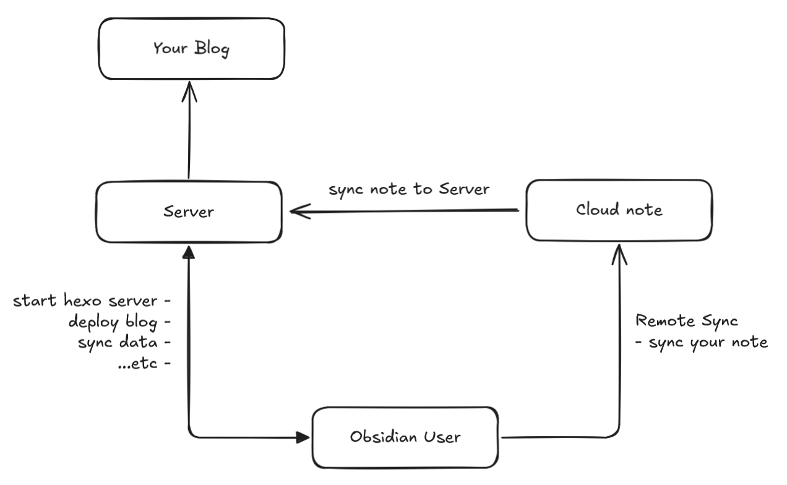

# Obblogdian

Hi, I'm WhiteDragon. This is a small side project I built to make it easier to write your blog in Obsidian instead of VS Code.

## How it works

- **Server**
  The server simulates an environment that can run Hexo commands such as `hexo deploy` and `hexo server`.

- **Cloud note**
  Cloud notes are used to sync your notes across devices using WebDAV and an Obsidian plugin called "Remotely Save".

- **Obsidian**
  Just obsidian, a makrdown editor

## Usage guide

Here's how to get started:

- [Run the server](./Other/Obblogdian-blog.md)
- [Install the Obblogdian plugin](./Other/Obblogdian-Plugin.md)

## Obsidian Plugin Commands

Here's what each command does:

| Commands               | Description                                                         |
| ---------------------- | ------------------------------------------------------------------- |
| **Deploy Blog**        | Deploy your blog to the internet by running `hexo deploy`.          |
| **Preview Blog**       | Open the side preview.                                              |
| **Clean Temp**         | Clean all temporary files generated by the side preview.            |
| **Create Metadata**    | Create metadata in the post header (front matter).                  |
| **Start Blog Server**  | Start the online preview (runs `hexo clean -> generate -> server`). |
| **Stop Blog Server**   | Stop the online preview.                                            |
| **Sync Blog**          | Sync data from Obsidian to the server.                              |
| **Auto Render Update** | Automatically render updates for the side preview.                  |
| **Render All**         | Render all Markdown.                                                |
| **Auto Sync Update**   | Automatically sync updates to the server.                           |

## Hexo Blog Server API

| Method | Route                                      | Description                    |
| ------ | ------------------------------------------ | ------------------------------ |
| POST   | `https://<server.domain>/api/deploy`       | Deploy blog                    |
| POST   | `https://<server.domain>/api/ping`         | Test server connectivity       |
| POST   | `https://<server.domain>/api/server/start` | Start Hexo server              |
| POST   | `https://<server.domain>/api/server/stop`  | Stop Hexo server               |
| POST   | `https://<server.domain>/api/sync`         | Sync Markdown data to the server |