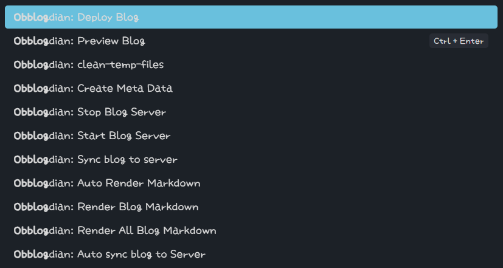

# Obblogdian

A comprehensive blog management system that integrates Obsidian with Hexo for seamless content creation and publishing.

## 📖 Overview

Obblogdian consists of two main components:
- **Blog API Server** - Deploy on your VPS for blog management
- **Obsidian Plugin** - Install in Obsidian for content creation

## 🏗️ Architecture

```
┌─────────────────┐    ┌──────────────────┐     ┌─────────────────┐
│   Obsidian      │    │    Blog API      │     │     Hexo        │
│   Plugin        │─ ─▶│    Server        │───▶│   Static Site   │
│   (Local)       │    │    (VPS)         │     │   Generator     │
└─────────────────┘    └──────────────────┘     └─────────────────┘
```

這是錯的笑死

## 📂 Project Structure

```
Obblogdian/
├── Blog/                 # 🚀 Deploy this to your VPS
│   ├── api/              # API endpoints
│   ├── utils/            # Utility functions
│   ├── hexo/             # Hexo blog files
│   ├── index.js          # Main server file
│   └── package.json      # Dependencies
│
├── Obsidian Plugin/      # 📦 Install this as Obsidian plugin
│   ├── src/              # Plugin source code
│   ├── main.ts           # Plugin entry point
│   ├── manifest.json     # Plugin manifest
│   └── package.json      # Plugin dependencies
│
└── Hexo/                 # 📝 Sample Hexo configuration
    └── index.js          # Hexo utilities
```

## 🚀 Quick Start

### 1. VPS Deployment (Blog Folder)

當參考就好

1. **Upload the Blog folder to your VPS**
   ```bash
   scp -r Blog/ user@your-server:/path/to/blog/
   ```

2. **Install dependencies**
   ```bash
   cd /path/to/blog/
   npm install
   ```

3. **Configure environment variables**
   ```bash
   cp .env.example .env
   nano .env
   ```

4. **Set up your Hexo blog in the hexo/ folder**
   ```bash
   cd hexo/
   npx hexo init .
   npm install
   ```

5. **Start the API server**
   ```bash
   npm start
   # or with PM2
   pm2 start index.js --name "blog-api"
   ```

### 2. Obsidian Plugin Installation

1. **Manual Installation**
   - Copy the `Obsidian Plugin/` folder to your Obsidian vault's `.obsidian/plugins/` directory
   - Rename it to `obblogdian`
   - Enable the plugin in Obsidian settings

2. **Build from Source**
   ```bash
   cd "Obsidian Plugin/"
   npm install
   npm run build
   ```

## ⚙️ Configuration

### Blog API Server (.env)

這個還可以

```env
# Server Configuration
API_PORT=3000
PREVIEW_PORT=4000
SERVER_LINK=http://your-domain.com:4000

# Authentication
API_TOKEN=your-secure-api-token

# WebDAV Settings (for sync)
WEBDAV_URL=https://your-webdav-server.com
WEBDAV_USERNAME=your-username
WEBDAV_PASSWORD=your-password
WEBDAV_REMOTE_BASE=/path/to/posts

# Auto Shutdown (minutes)
AUTO_SHUTDOWN=30
```

### Obsidian Plugin Settings

Configure in Obsidian Settings → Plugin Options → Obblogdian:

- **API URL**: Your VPS blog API endpoint
- **API Token**: Same as in .env file
- **Auto Sync**: Enable automatic synchronization
- **Auto Update**: Enable automatic updates

## 🔧 API Endpoints

這是對的

### Server Management
- `POST /api/server/start` - Start Hexo preview server
- `POST /api/server/stop` - Stop Hexo preview server

### Content Management
- `POST /api/sync` - Sync posts from WebDAV
- `POST /api/deploy` - Deploy blog to production

### Authentication
All endpoints require Bearer token authentication:
```bash
curl -H "Authorization: Bearer your-api-token" \
     -X POST http://your-server:3000/api/server/start
```

## 🛠️ Features

### Blog API Server
- ✅ Hexo integration with child process management
- ✅ WebDAV synchronization
- ✅ Automatic server shutdown
- ✅ RESTful API design
- ✅ Token-based authentication
- ✅ Cross-platform support (Windows/Linux)

### Obsidian Plugin
- ✅ Seamless blog management from Obsidian
- ✅ Custom markdown rendering
- ✅ Server status monitoring
- ✅ One-click sync and deploy
- ✅ Auto-update functionality

## 🔒 Security

- **API Token Authentication**: All endpoints protected with Bearer tokens
- **Environment Variables**: Sensitive data stored in .env files
- **Auto Shutdown**: Prevents resource waste with configurable timeout

## 📊 System Requirements

### VPS Requirements
- Node.js 16+ 
- NPM or Yarn
- Git (for Hexo deployment)
- 1GB+ RAM
- 10GB+ Storage

### Obsidian Requirements
- Obsidian 0.15.0+
- Internet connection for API calls

## 🐛 Troubleshooting

### Common Issues

1. **Circular Dependency Warnings**
   - Use delayed loading pattern with `getHexoUtils()`
   - Avoid direct requires in module headers

2. **Hexo Server Won't Stop**
   - Uses platform-specific process termination
   - Windows: `taskkill`, Linux: `SIGINT → SIGTERM → SIGKILL`

3. **API Connection Failed**
   - Check VPS firewall settings
   - Verify API_TOKEN matches in both places
   - Ensure correct ports are open
Hi, Im whitedraogn, this is a small side-project I develope for a better way to write your blog in obsidian and not in vscode anymore, so let me introduce how to install this

### Debug Mode
# installition

Enable verbose logging:
```bash
NODE_ENV=development npm start
```
> read in both file

## 🤝 Contributing

1. Fork the repository
2. Create your feature branch (`git checkout -b feature/amazing-feature`)
3. Commit your changes (`git commit -m 'Add amazing feature'`)
4. Push to the branch (`git push origin feature/amazing-feature`)
5. Open a Pull Request
# Usage

## 📄 License
## Obsidian Plugin

This project is licensed under the MIT License - see the [LICENSE](LICENSE) file for details.
So as you can see there are alot of commands, and here is what each command do

## 🔗 Related Links


- [Hexo Documentation](https://hexo.io/docs/)
- [Obsidian Plugin Development](https://docs.obsidian.md/Plugins/Getting+started/Build+a+plugin)
- [WebDAV Protocol](https://tools.ietf.org/html/rfc4918)
- Deploy Blog
<div style="display: flex; gap: 20px;">
<div>

## ❤️ Acknowledgments
**Left Column**  
Item A  
Item B  

- Hexo community for the amazing static site generator
- Obsidian team for the extensible note-taking platform
- All contributors who helped improve this project
</div>
<div>

---
**Right Column**  
Some text or an image.
qweqwe
qwe
qwe
qwe
qwe

**Made with ❤️ for seamless blogging**
</div>
</div>