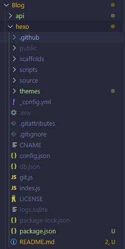

# 1. Copy your hexo in here
will look like this


# 2. Copy isntall dependencies under blog folder
or copy package dependencies json to the one outside

```json
"dependencies": {
    "axios": "^1.8.4",
    "dotenv": "^16.4.7",
    "express": "^4.21.2",
    "hexo": "^7.3.0",
    "hexo-admonition": "^1.1.2",
    "hexo-all-minifier": "^0.5.2",
    "hexo-deployer-git": "^4.0.0",
    "hexo-generator-archive": "^2.0.0",
    "hexo-generator-category": "^2.0.0",
    "hexo-generator-index": "^4.0.0",
    "hexo-generator-searchdb": "^1.4.1",
    "hexo-generator-tag": "^2.0.0",
    "hexo-renderer-ejs": "^2.0.0",
    "hexo-renderer-marked": "^6.3.0",
    "hexo-renderer-stylus": "^3.0.1",
    "hexo-server": "^3.0.0",
    "hexo-wordcount": "^6.0.1",
    "markdown-it-table": "^4.1.1",
    "webdav": "^5.7.1"
  }
```